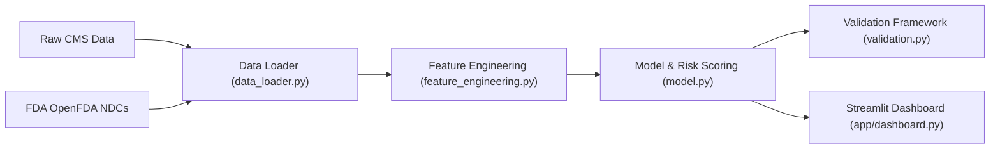

# Detecting Insulin Rationing in Prescription Claims Data

> An end-to-end machine learning pipeline for identifying potential insulin rationing behaviors among diabetic patients using CMS DE-SynPUF prescription claims.

---

## 1. Problem Statement & Clinical Context

Insulin is a life-critical hormone required by millions of individuals living with diabetes. Due to rising out-of-pocket costs, insurance coverage gaps, and financial strain, some patients engage in **insulin rationing**—intentionally delaying refills, skipping doses, or reducing dosage amounts to stretch their supply.

### Clinical & Financial Risks
* **Clinical Harm**: Extended gaps between refills lead to severe hyperglycemia, diabetic ketoacidosis (DKA), long-term microvascular and macrovascular complications, and emergency department hospitalizations.
* **Financial Strain**: Escalating copays and deductibles force patients to choose between essential medication and basic living expenses.
* **Surveillance Gap**: Traditional claims monitoring systems focus on overall compliance (e.g., Medication Possession Ratio) but fail to detect **progressive refill delay trends** and cost-burden acceleration over time.

---

## 2. Dataset Overview & Caveats

### Dataset Metadata
* **Dataset Name**: CMS Data Entrepreneur Synthetic Public Use Files (DE-SynPUF)
* **Source**: Centers for Medicare & Medicaid Services (CMS)
* **Data Files**: 
  * Beneficiary Summary File (`DE1_0_2008_Beneficiary_Summary_File_Sample_1.csv`)
  * Prescription Drug Events File (`DE1_0_2008_to_2010_Prescription_Drug_Events_Sample_1.csv`)
* **Reference Data**: OpenFDA National Drug Code (NDC) Directory (210 normalized insulin product NDCs)

> [!NOTE]  
> **Synthetic Data Caveat**: The CMS DE-SynPUF dataset is a synthetic, non-identifiable public use file created to protect beneficiary privacy. While it preserves structure and covariate relationships, it contains synthetic perturbations and sparse refill observations across sample slices.

---

## 3. Pipeline Architecture

The processing pipeline consists of five modular, fully tested components:

1. **NDC Reference Builder (`src/reference/build_insulin_ndc_list.py`)**: Fetches brand and generic insulin NDCs from openFDA with automatic HTTP retry logic.
2. **Data Loader (`src/data_loader.py`)**: Filters beneficiaries for chronic diabetes (`SP_DIABETES == 1`), matches 11-digit normalized insulin NDCs, and parses dates.
3. **Feature Engineering (`src/feature_engineering.py`)**: Computes per-patient longitudinal metrics:
   * `actual_gap_days`: Days elapsed between consecutive fills ($t_{i+1} - t_i$).
   * `gap_vs_supply_ratio`: Ratio of actual gap days to prescribed days supply ($\frac{\text{actual\_gap\_days}}{\text{DAYS\_SUPLY\_NUM}}$).
   * `mean_gap_ratio` & `std_gap_ratio`: Summary statistics of refill gaps.
   * `gap_trend_slope`: Linear regression slope of `gap_vs_supply_ratio` over fill sequence ($0, 1, 2, \dots$).
   * `pay_amt_trend`: Linear regression slope of out-of-pocket copay (`PTNT_PAY_AMT`) over time in days.
4. **Model & Risk Scoring (`src/model.py`)**: Standardizes features with `StandardScaler` and fits an `IsolationForest` anomaly model. Produces a normalized $[0.0, 100.0]$ composite `risk_score`.
5. **Validation Framework (`src/validation.py`)**: Injects synthetic rationing patterns into unlabelled data to empirically validate pipeline sensitivity.
6. **Interactive Dashboard (`app/dashboard.py`)**: Web dashboard for patient risk triage and longitudinal fill history visualization.

---

## 4. Model Selection: Why Unsupervised IsolationForest?

In real-world medical claims databases, **no ground-truth labels exist** indicating whether a patient actually rationed their insulin. 

### Why Supervised Learning is Unfeasible
Supervised classifiers (e.g. XGBoost, Logistic Regression) require labelled positive and negative instances. Obtaining verified ground-truth rationing labels would require invasive clinical interviews or patient self-reporting, which are absent in administrative claims.

### Why IsolationForest Was Selected
* **Unsupervised Anomaly Isolation**: IsolationForest isolates anomalies by randomly partitioning feature values. Outliers with extreme behaviors require fewer splits to isolate and appear near the root of decision trees.
* **Multi-Dimensional Risk Detection**: Patients exhibiting a combination of steep positive gap trends (expanding refill delays), high gap variance, and rising out-of-pocket cost burden are isolated as extreme anomalies in the feature space without requiring prior training labels.

---

## 5. Synthetic Validation & Empirical Results

To prove that the pipeline detects the target rationing pattern, we conducted a controlled synthetic injection experiment (`scripts/run_validation.py`). Rationing behavior was injected into 15.0% of beneficiaries by progressively expanding their refill gaps over time ($m_i = 1.0 + 0.40 \times i$).

### Empirical Validation Findings

| Metric | Synthetic Rationers (Injected) | Control Group (Rest) | Empirical Performance |
| :--- | :---: | :---: | :---: |
| **Beneficiary Count** | 23 (15.0%) | 127 (85.0%) | Total $N = 150$ |
| **Flagged Anomaly Rate (%)** | **60.9%** (14 / 23) | **0.8%** (1 / 127) | **77.30x Detection Lift** |
| **Mean Risk Score (0–100)** | **70.73** | **17.12** | **+53.61 Point Margin** |

> [!IMPORTANT]  
> **Key Validation Finding**: The pipeline demonstrated a **77.30x detection lift** (60.9% vs 0.8% flagged rate) for beneficiaries exhibiting progressive refill delays, confirming that the unsupervised model effectively targets the engineered rationing signatures.

---

## 6. System Limitations & Ethical Governance

> [!WARNING]  
> **Explicit System Limitations**:
> 1. **No Ground-Truth Guarantees**: Refill delays can occasionally stem from medication changes, physician samples, hospitalizations, or mail-order overlaps rather than financial rationing.
> 2. **Synthetic Data Constraints**: Results generated on CMS DE-SynPUF data serve demonstration purposes and require re-tuning when applied to commercial or Medicare Advantage claims databases.
> 3. **Not a Clinical Diagnostic Tool**: This pipeline is an administrative risk-triage tool. Flagged beneficiaries **must be routed to clinical care managers or pharmacists for human outreach**, never used to deny coverage or automate adverse benefit determinations.
